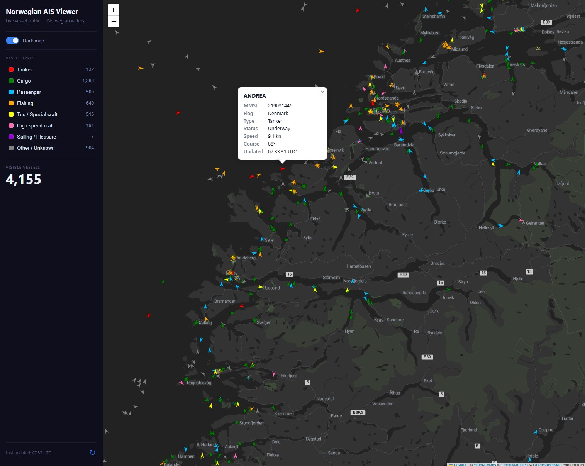

# Norwegian AIS Viewer

A live vessel traffic viewer for Norwegian waters built with FastAPI and React. The app displays real-time AIS positions from the [BarentsWatch](https://www.barentswatch.no/) API on an interactive map, with a focus on tanker monitoring and shadow fleet tracking in the Norwegian Economic Zone.



---

## Features

- SVG vessel markers coloured by type, rotated to heading
- Click any vessel for name, MMSI, flag state, type, nav status, speed, course, and last update time
- Filter vessels by type directly from the sidebar legend
- Live vessel counts per category
- CartoDB Voyager (light) and Stadia Alidade Smooth Dark tile layers
- Map viewport preserved across data refreshes and filter changes

---

## Architecture

```
norwegian-ais-viewer-react/      ← monorepo root
├── backend/                     ← FastAPI (Python)
│   ├── main.py                  ← API server + BarentsWatch client
│   ├── requirements.txt
│   └── .env.example
└── frontend/                    ← React + Vite (TypeScript)
    ├── src/
    │   ├── App.tsx
    │   ├── components/
    │   │   ├── VesselMap.tsx    ← react-leaflet map + markers
    │   │   └── Sidebar.tsx      ← legend, filters, controls
    │   ├── hooks/
    │   │   └── useVessels.ts    ← data fetching
    │   ├── utils/
    │   │   └── vesselTypes.ts   ← AIS type → category + colour
    │   └── data/
    │       └── midLookup.ts     ← MMSI MID → flag state
    ├── package.json
    └── vite.config.ts
```

The React frontend calls a single backend endpoint (`GET /api/vessels`). The backend handles all BarentsWatch OAuth2 authentication and caches the access token until expiry.

---

## Requirements

| Dependency | Version |
|---|---|
| Python | 3.10 or later |
| Node.js | 20.x or later (LTS recommended) |
| BarentsWatch API credentials | [Register at barentswatch.no](https://www.barentswatch.no/minside/) |

> **Node version note:** Vite 8 requires Node ≥ 20.19. This project uses Vite 6.4 to remain compatible with Node 20.x without a specific minimum patch version.

---

## Setup

### 1. Clone

```bash
git clone <repo-url>
cd norwegian-ais-viewer-react
```

### 2. Backend

```bash
cd backend
python -m venv .venv
source .venv/bin/activate      # Windows: .venv\Scripts\activate
pip install -r requirements.txt
```

Create a `.env` file from the example:

```bash
cp .env.example .env
```

Open `.env` and fill in your BarentsWatch credentials:

```dotenv
BW_CLIENT_ID=your_client_id_here
BW_CLIENT_SECRET=your_client_secret_here
```

### 3. Frontend

```bash
cd frontend
npm install
```

---

## Running

Open two terminal windows, one for each service.

**Backend** (from `backend/`):

```bash
uvicorn main:app --reload
```

The API will be available at `http://localhost:8000`. The single endpoint is `GET /api/vessels`.

**Frontend** (from `frontend/`):

```bash
npm run dev
```

Open `http://localhost:5173` in your browser.

---

## Vessel type colour scheme

| Category | AIS ship type codes | Colour |
|---|---|---|
| Tanker | 80 – 89 |  `#FF0000` |
| Cargo | 70 – 79 |  `#008000` |
| Passenger | 60 – 69 |  `#00BFFF` |
| Fishing | 30 |  `#FFA500` |
| Tug / Special craft | 50 – 59 |  `#FFFF00` |
| High speed craft | 40 – 49 |  `#FF69B4` |
| Sailing / Pleasure | 36, 37 |  `#9400D3` |
| Other / Unknown | everything else |  `#808080` |

---

## Data coverage

The BarentsWatch AIS feed covers vessels operating in and transiting the **Norwegian Economic Zone (NEZ)**. This includes Norwegian coastal waters, the North Sea, and Svalbard approaches.

A few things to be aware of:

- **Small fishing vessels and leisure craft** under the AIS carriage threshold (< 15 m in Norwegian coastal waters) do not transmit AIS and are not shown.
- **Satellite AIS** is not included — only terrestrial AIS from shore stations. Coverage degrades in the northern Barents Sea and open ocean beyond coastal station range.
- Vessel positions are live snapshots; the timestamp in the popup shows when the individual vessel last transmitted.
